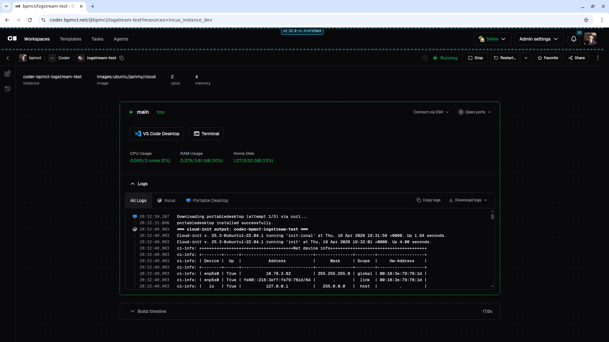

# coder-logstream-incus

[](https://github.com/bpmct/coder-logstream-incus/actions/workflows/release.yml)

Stream Incus VM console and cloud-init logs to [Coder](https://coder.com) workspace startup logs — analogous to [`coder-logstream-kube`](https://github.com/coder/coder-logstream-kube) for Kubernetes.



## How it works

The daemon runs on the same host as `incusd`. It polls the Incus API every 5 seconds for instances that have the `user.coder-agent-token` config key set. When a new instance is found, it:

1. **Dumps the console log buffer** (full boot output via `incus console --show-log`)
2. **Tails `/var/log/cloud-init-output.log`** via the Incus file API, streaming new lines every 2 seconds
3. Stops streaming once `/run/cloud-init/result.json` exists (cloud-init has finished) or the instance is removed

All output is sent to the Coder agent's startup logs so it appears in the workspace build log UI.

## Installation

### One-liner (recommended)

Run as root on the Incus host:

```bash
curl -fsSL https://raw.githubusercontent.com/bpmct/coder-logstream-incus/main/install.sh | \
  CODER_URL=https://coder.example.com bash
```

This downloads the latest binary, installs it to `/usr/local/bin`, writes a systemd unit, and starts the service.

**Options** (set as env vars before the pipe):

| Variable | Default | Description |
|----------|---------|-------------|
| `CODER_URL` | — (required) | URL of your Coder deployment |
| `INCUS_PROJECT` | `default` | Incus project to watch |
| `INSTALL_DIR` | `/usr/local/bin` | Where to install the binary |
| `VERSION` | latest | Release tag to install (e.g. `v0.1.1`) |

### Manual

Download a binary from the [releases page](https://github.com/bpmct/coder-logstream-incus/releases) and run:

```bash
coder-logstream-incus --coder-url https://coder.example.com
```

## Usage

| Flag | Env | Default | Description |
|------|-----|---------|-------------|
| `--coder-url` | `CODER_URL` | — | URL of the Coder deployment |
| `--socket` | `INCUS_SOCKET` | (auto) | Path to Incus Unix socket |
| `--project` | `INCUS_PROJECT` | `default` | Incus project to watch |
| `--poll-interval` | `CODER_INCUS_POLL_INTERVAL` | `5s` | How often to poll for instances |

## Coder template integration

Set `user.coder-agent-token` on the Incus instance so the daemon can detect it and stream to the right workspace agent. The token must be updated on every workspace start (it rotates each build):

```hcl
resource "incus_instance" "dev" {
  name  = "coder-${data.coder_workspace_owner.me.name}-${data.coder_workspace.me.name}"
  image = "ubuntu/jammy/cloud"
  type  = "virtual-machine"

  config = {
    "user.coder-agent-token" = coder_agent.main.token
    "cloud-init.user-data"   = "..."
  }

  lifecycle {
    # token and cloud-init are updated out-of-band by null_resource below
    ignore_changes = [config["user.coder-agent-token"], config["cloud-init.user-data"]]
  }
}

# Runs on every workspace start to refresh the token and restart the agent
resource "null_resource" "token_refresh" {
  count = data.coder_workspace.me.start_count
  triggers = { token = coder_agent.main.token }

  provisioner "local-exec" {
    command = <<-EOT
      incus config set ${incus_instance.dev.name} user.coder-agent-token ${coder_agent.main.token}
      incus exec ${incus_instance.dev.name} -- bash -c '
        printf "CODER_AGENT_TOKEN=${coder_agent.main.token}\nCODER_AGENT_URL=${data.coder_workspace.me.access_url}\n" > /opt/coder/init.env
        systemctl restart coder-agent
      '
    EOT
  }
}
```

## Building

```bash
go build -o coder-logstream-incus .
```

Requires Go 1.22+.

## Architecture

- **`main.go`** — CLI entrypoint using [`serpent`](https://github.com/coder/serpent)
- **`logger.go`** — Core logic: instance watcher, per-VM streaming goroutines, log sender

The daemon uses the [Coder agent SDK](https://pkg.go.dev/github.com/coder/coder/v2/codersdk/agentsdk) to POST logs. On Coder v2.31.0+, it uses `ConnectRPC28WithRole("logstream-incus")` to avoid triggering false agent connectivity state changes.

## Disclaimer
AI was used to help code this repo. I have a software development background and reviewed the implementation, but use at your own risk.
